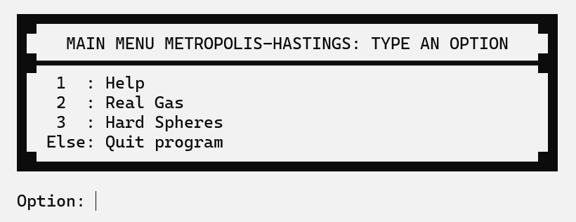

# Simulation of Thermodynamic Systems
### Simulating the Hard Spheres Gas
**Using the Metropolis-Hastings algorithm to calculate properties of Thermodynamic Systems**

## Description
This is a project I made in my Professional Practices, designed to be an illustrative simulation of a gas made of *Hard Spheres* for **Statistical Mechanics** courses, under the supervision and direction of Dr. Thomas Gorin. The program is inspired by the 1953 article: [*Equation of State Calculations by Fast Computing Machines*](https://doi.org/10.1063/1.1699114), by Metropolis N. et al. The program presented here is a demo for privacy reasons.


<sup>Illustrative gif of how the Metropolis Algortihm works.</sup>

## Usage
The project was delevoped in SciLab (a MATLAB open-source alternative). However, the User Interface of the program is console-based, so you need to be able to run SciLab as an environment variable.

### Running the program.
To run the program, you have to write the following text in the console:
```bash
wscilex-cli -f MetropolisHastings.sce
```

### Results
Inside the program, you can change some of the system properties before running the simulation. The results will be displayed in three plots:
- **Thermodynamic Variables:** Here, it is shown the value of *(PV/NkT - 1)* as the control parameter *(A/A0 - 1)* varies.
- **Radial Distribution Histogram:** You can choose one of the values of *(A/A0 - 1)*, and the histogram used to calculate *(PV/NkT) - 1* will be shown.
- **Initial/Final Position:** A more illustrative plot, highlights the change in the position of the particles at the beggining and the end of the simulation.

The documentation about some functions of the program, the algorithm, and the theory can be accessed through the *Help* section.

## Example Output
The following image is the Main Menu UI you will see when running the program:


<sup>Main Section UI of the program.</sup>

## Acknowledgments
*This work was developed under the supervision and direction of Dr. Thomas Gorin.*

## License
This project is licensed under the GNU General Public License v3.0 ([LICENSE](LICENSE))
